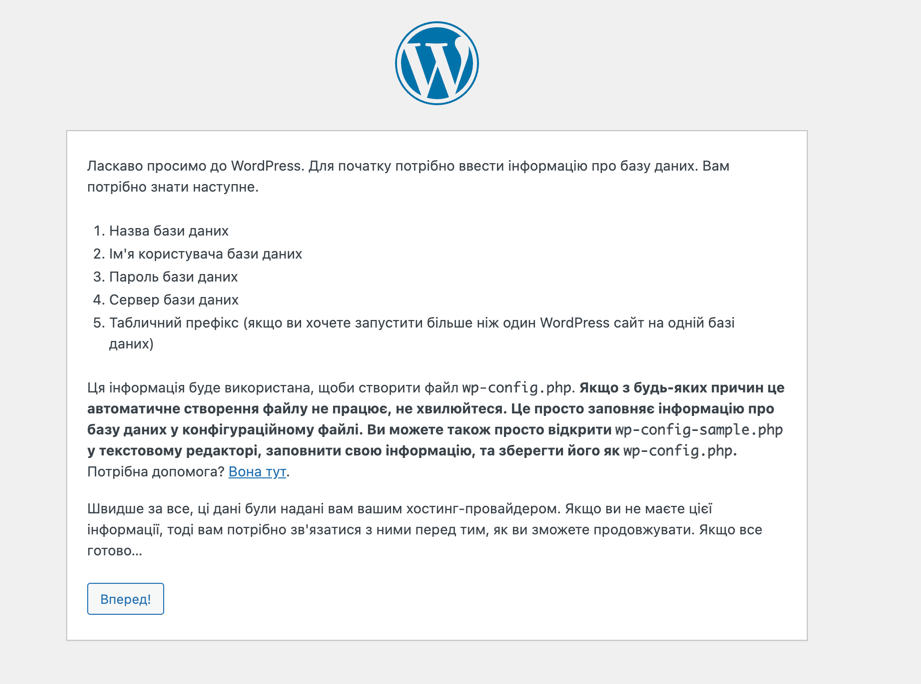
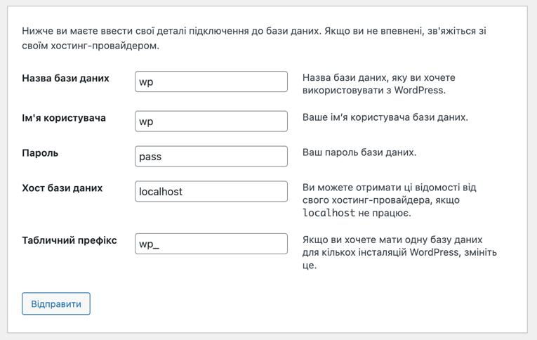

# Встановлення LEMP

Встановимо необхідні пакети

~~~
sudo apt install nginx php-fpm php-mysql mysql-server mysql-client unzip
~~~

Завантажимо Wordpress

~~~
wget https://uk.wordpress.org/latest-uk.zip
~~~

Розархівуємо завантажений архів

~~~
unzip latest-uk.zip
~~~

Скопіюємо Wordpress в робочу директорію та змінимо власника

~~~
sudo cp -r wordpress/ /var/www/ && sudo chown -R www-data:www-data /var/www/wordpress
~~~

Відредагуємо файл конфігурації для Nginx `/etc/nginx/sites-available/default`

~~~
server {
        server_name default;
        
        root /var/www/wordpress;
        index index.php;

        location = /favicon.ico {
                log_not_found off;
                access_log off;
        }

        location = /robots.txt {
                allow all;
                log_not_found off;
                access_log off;
        }

        location / {
                try_files $uri $uri/ /index.php?$args;
        }

        location ~ \.php$ {
                include fastcgi_params;
                fastcgi_intercept_errors on;
                fastcgi_pass unix:/var/run/php/php7.4-fpm.sock;
                fastcgi_param  SCRIPT_FILENAME $document_root$fastcgi_script_name;
        }

        location ~* \.(js|css|png|jpg|jpeg|gif|ico)$ {
                expires max;
                log_not_found off;
        }
}
~~~

Перезапустивши Nginx отримаємо

Створимо користувача та базу даних

~~~
create database wp;
CREATE USER 'wp'@'localhost' IDENTIFIED BY 'pass';
GRANT ALL PRIVILEGES ON wp.* TO 'wp'@'localhost';
~~~

